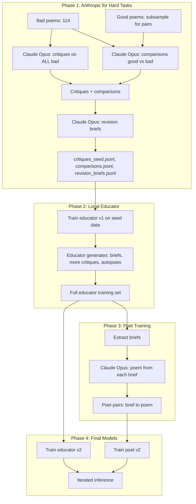

# Training Pipeline Revision Plan (Updated)

## Root Cause Analysis

The poet model outputs educator-style content (brief format) instead of poems. Causes: format confusion from long structured briefs, no explicit output boundary in training, possible continuation behavior.

---

## Phase 1: Delete Existing Prompts and Training Data

**Files/directories to remove or clear:**

| Target | Action |
|--------|--------|
| `data/educator_training/` (briefs.jsonl, dialogues.jsonl, lessons.jsonl, train.jsonl, valid.jsonl) | Delete |
| `data/poet_training/` (pairs.jsonl, train.jsonl, valid.jsonl) | Delete |
| `data/annotated/` (critiques.jsonl, autopsies.jsonl, comparisons.jsonl) | Delete |
| `persona/` (pedagogy_design_doc.md, persona_condensed.txt, anti_llm_isms.txt) | Delete |
| `scripts/data_generation/` (generate_*.py, prepare_training_data.py) | Delete — replace with new scripts |
| `config/data_generation.yaml` | Delete or replace |

**Preserve:** Raw poem corpora (`data/raw/`, `data/processed/`) — source material for new generation.

---

## Phase 2: Anthropic for Hard Tasks (Not Hard Poems)

**Principle:** Use Anthropic API for the *task types* that require the most judgment and nuance, regardless of which specific poems are used. We don't know "hard poems" in advance.

**Hard tasks (Anthropic Opus):**
- **Critiques** — Requires discriminating what works vs. fails, naming failure types, offering direction. High judgment.
- **Comparisons** — Good vs. bad poem pairs. Requires explaining *why* one is stronger. Contrastive by design.
- **Revision briefs** — Translating critique into actionable generation instructions. Requires synthesis.

**Easier tasks (local educator or Sonnet):**
- **Generation briefs** — From user request. More formulaic (angle, clichés, imagery, form).
- **Autopsies** — Cliché dissection. Structured format (what/why/replacement).
- **Lessons** — Craft Q&A. Can be templated.

---

## Phase 3: Contrastive Learning with Good vs. Bad Poems

**Data imbalance:** ~34,000 good poems vs. ~114 bad poems (~300:1). Bad poems must be oversampled and used in multiple contrastive tasks.

**Contrastive task design:**

1. **Comparisons (good vs. bad)**
   - Pair each bad poem with a good poem on similar topic/theme (or random good).
   - Output: "Poem A is stronger because... Poem B fails at..."
   - Each bad poem used once per comparison → 114 comparison pairs minimum.
   - Use Anthropic (hard task).

2. **Critiques on bad poems**
   - Every bad poem gets a critique (what's alive, what fails, direction).
   - 114 critiques on bad poems. Use Anthropic.
   - Critiques on good poems: subsample (e.g., 200–500) to avoid overwhelming with "this works" examples. Use local educator for bulk.

3. **Autopsies on bad poems**
   - Cliché dissection for each bad poem. 114 autopsies.
   - Use local educator (more formulaic task).

4. **Balancing strategy**
   - **Bad poems:** Use each in 3+ tasks (comparison, critique, autopsy). Total bad-poem-derived examples: ~114 × 3 = 342+.
   - **Good poems:** Subsample for critiques (200–500), use all 114 for comparison pairs, optionally add good-poem critiques for "what works" diversity.
   - **Target educator mix:** ~40% from bad-poem contrastive tasks (comparisons, bad critiques, autopsies), ~60% from good-poem critiques, briefs, lessons. Prevents educator from only seeing "good" examples.

---

## Phase 4: Two-Phase Data Generation Pipeline

**Phase 1 — Anthropic (hard tasks):**
- Critiques on all 114 bad poems (Opus)
- Critiques on subsample of good poems (e.g., 200) for balance (Opus)
- Comparisons: 114 pairs (bad + matched good) (Opus)
- Revision briefs: from critique + poem pairs (Opus) — e.g., 50–100
- Output: `critiques_seed.jsonl`, `comparisons.jsonl`, `revision_briefs_seed.jsonl`

**Phase 2 — Interim educator + local generation:**
- Train interim educator on seed data only (critiques, comparisons, revision briefs)
- Export and download interim educator GGUF
- Interim educator generates locally: briefs, autopsies, lessons (no Anthropic for these)
- Balancing: ensure bad-poem-derived examples are ~40% of educator training

**Phase 3 — Poet training:**
- Briefs from educator output
- Poems from Claude (Opus) given those briefs

**Phase 4 — Final training:**
- Educator v2 on full set
- Poet v2 on (brief, poem) pairs with new format

---

## Phase 5: New Educator Design — Issue-Focused

- **Generation brief:** Compact (~400 tokens max). Angle, 5–6 clichés, imagery domain, form. No rhetorical flourish.
- **Critique:** Structured. What works / issues (type, location, direction) / approval signal.
- **Revision brief:** Same compact format.
- **Persona:** Neutral educator, not "Maren." Focus on craft issues, minimal voice.

---

## Phase 6: New Poet Design — Poem-Only Output

- **Training format:** `(brief + "Write the poem. Output ONLY the poem.", poem)`
- **Shorter briefs** in poet training (cap ~300 tokens)
- **System prompt:** "You are a poet. You receive generation briefs and write poems. You never output instructions, critique, or analysis — only poems."
- **Inference:** Add "Output ONLY the poem. Do not repeat the brief."

---

## Summary of Changes from Original Plan

| Original | Updated |
|----------|---------|
| Anthropic for "hard poems" (unknown in advance) | Anthropic for **hard tasks** (critiques, comparisons, revision briefs) |
| No explicit contrastive design | **Contrastive learning:** comparisons (good vs bad), critiques on bad, autopsies on bad |
| No balancing | **Balancing:** 114 bad vs 34k good → oversample bad, use each in 3+ tasks, target ~40% bad-derived in educator mix |
| Single critique generation | **Stratified:** All bad get Opus critiques; good get subsample Opus + bulk local |
